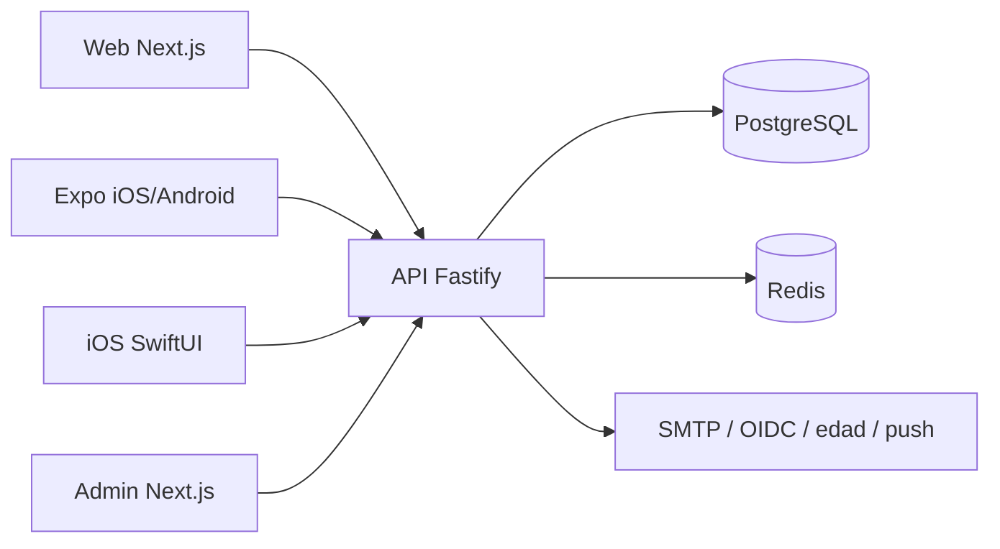

# Arquitectura

NOW es un monolito modular desplegable con clientes separados. La API Fastify expone REST y WebSocket; PostgreSQL guarda el estado transaccional y Redis coordina rate limiting, presencia y trabajos cuando está configurado. En local, PGlite conserva la misma semántica SQL sin servicios externos.

Los módulos de autenticación, matching, seguridad y proveedores se mantienen separados dentro de `apps/api/src`. Los límites de dominio viven en `packages/domain`; contratos y errores compartidos, en `packages/types`; el cliente móvil reutilizable, en `packages/api-client`.

## Flujo principal

1. El cliente crea una intención con actividad, duración, radio, visibilidad y una coordenada aproximada.
2. La API cuantiza la coordenada antes de persistirla y busca candidatos con filtros duros.
3. El motor puntúa compatibilidad, distancia, tiempo, fiabilidad y diversidad; forma un grupo idempotente.
4. Se reserva un lugar público apto y se crea una propuesta de 90 segundos.
5. La confirmación total abre chat y check-in. La caducidad o un rechazo devuelven al resto al radar.
6. El trabajo de limpieza elimina ubicaciones efímeras, chats y notificaciones según retención.

## Consistencia y escala

Las mutaciones críticas se ejecutan en transacciones. El motor usa bloqueos lógicos e índices sobre estado, actividad, caducidad y celdas geográficas. Varias réplicas pueden compartir PostgreSQL y Redis; los trabajos usan claves idempotentes. Para más volumen, el módulo de matching puede extraerse sin cambiar los contratos públicos.

La API publica documentación interactiva en `/docs`, salud en `/health` y métricas operativas agregadas en el panel administrativo. No se registran coordenadas, tokens ni contenido de mensajes en logs.
